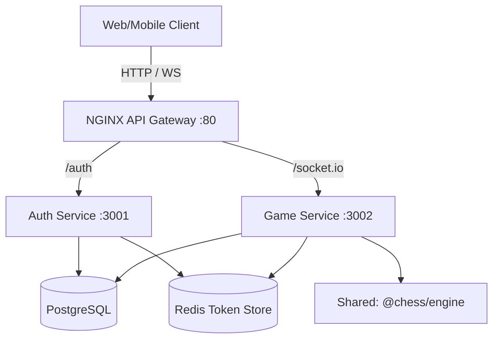

# Chess Platform

A production-grade, highly scalable chess platform featuring a custom Bitboard engine, real-time multiplayer matchmaking, and a robust microservices architecture. 

This repository is built using a **Monorepo** structure with **Turborepo** and **pnpm**, allowing shared code and fast builds across multiple isolated services.

## 🏗 Architecture Overview

The backend is composed of several independent services sitting behind an NGINX API Gateway:



### Microservices
1. **API Gateway (NGINX)**: Central routing and load balancing, handling WebSocket upgrades and CORS headers.
2. **Auth Service (`apps/auth-service`)**: Handles user registration, JWT lifecycle, RBAC, and email verification. Built with Express and Prisma.
3. **Game Service (`apps/game-service`)**: Handles matchmaking queues and real-time Socket.IO game rooms. 

### Shared Packages (`packages/`)
- **`@chess/engine`**: A high-performance, Bitboard-based chess engine used by the backend to validate all moves securely. Includes Move Generation and Perft testing.
- **`@chess/logger`**: Standardized JSON logging.
- **`@chess/errors`**: Shared error classes and HTTP status codes.
- **`@chess/config`**: Shared TypeScript and ESLint configurations.

## 🚀 Getting Started

### Prerequisites
- [Node.js](https://nodejs.org/en/) (v20+)
- [pnpm](https://pnpm.io/) (v9+)
- [Docker](https://www.docker.com/) & Docker Compose

### 1. Installation
Clone the repository and install all workspace dependencies:
```bash
git clone https://github.com/heyitsshubh/Chess_backend.git
cd Chess_backend
pnpm install
```

### 2. Environment Configuration
The `.env` files are tracked via `.env.example` templates. For development, the services default to localhost connections. Ensure you have the `RESEND_API_KEY` set in `apps/auth-service/.env` if you want to test live emails.

### 3. Start the Infrastructure
Start PostgreSQL, Redis, and NGINX in the background:
```bash
pnpm infra:up
```

### 4. Database Migrations
Push the database schemas to the local PostgreSQL instance:
```bash
pnpm --filter @chess/auth-service run db:push
pnpm --filter @chess/game-service run db:push
```

### 5. Start the Microservices
Run all services simultaneously using Turborepo:
```bash
pnpm dev
```

The platform is now available at `http://localhost`. 
- Auth endpoints: `http://localhost/auth/...`
- WebSocket connections: `ws://localhost/socket.io/...`

## 🛠 Useful Commands

- `pnpm build`: Build all applications and packages.
- `pnpm test`: Run tests across all workspaces (Vitest).
- `pnpm lint`: Run ESLint and Prettier checks.
- `pnpm format`: Format codebase with Prettier.
- `pnpm infra:down`: Stop and remove Docker containers.
- `pnpm infra:logs`: Tail the logs of the Docker infrastructure.

## 🔒 Security
- **Passwords**: Hashed with bcrypt.
- **Sessions**: JWT access tokens (short-lived) + refresh tokens stored securely in Redis with rotation support to detect stolen tokens.
- **Sockets**: Handshakes require valid JWTs. All moves are calculated on the server to prevent cheating.

## 📜 License
MIT License
